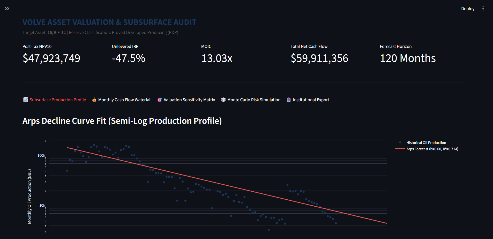

# Upstream Energy Analytics & Field Portfolio Valuation Engine
An interactive Python & Streamlit application for automated Arps Decline Curve Analysis (DCA), upstream Discounted Cash Flow (DCF) economics, and consolidated multi-well field portfolio aggregation.



## Key Features
* **Arps Decline Curve Analysis (DCA):** Exponential, hyperbolic, and harmonic fitting to forecast production streams and calculate EUR per wellbore.
* **Consolidated Field Aggregator (`FieldAggregatorEngine`):** Multi-well array alignment rolling up production, OPEX, royalties, and field CAPEX into portfolio-level economics.
* **Discounted Cash Flow Model (`UpstreamDCFEngine`):** Unlevered IRR, NPV10, payout timelines, and tax/royalty structures.

## Quickstart & Installation
```bash
# Clone repository
git clone [https://github.com/okotieoreremitchell/energy-analytics-dca.git](https://github.com/okotieoreremitchell/energy-analytics-dca.git)

# Navigate into directory
cd energy-analytics-dca

# Install dependencies
pip install -r requirements.txt

# Run Streamlit Application
streamlit run app.py